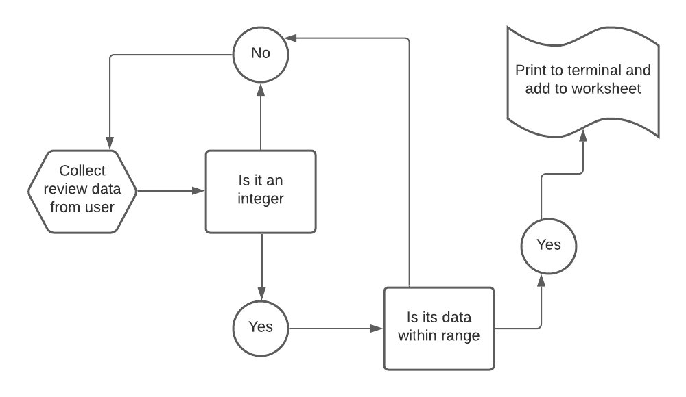
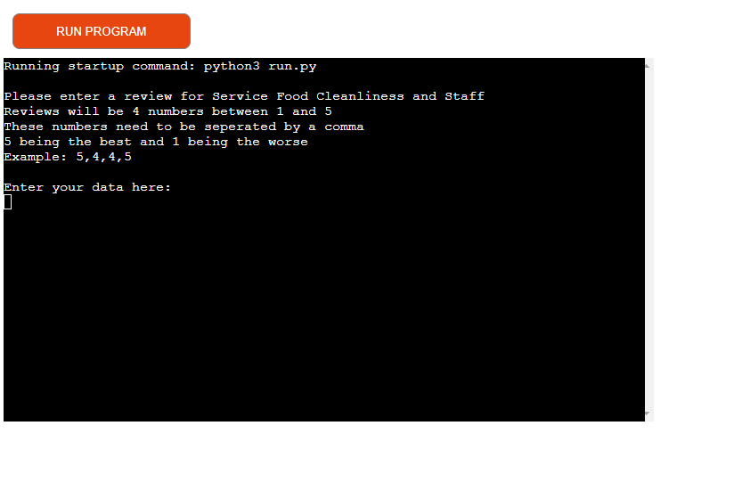
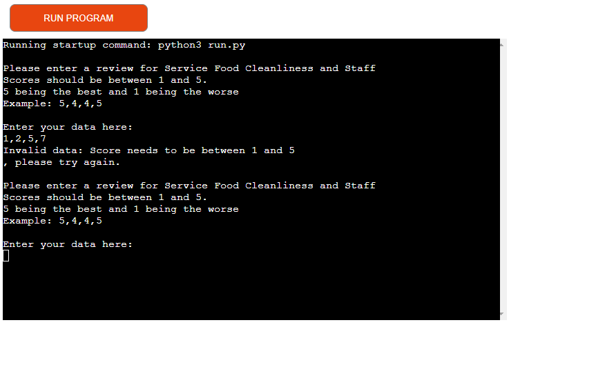
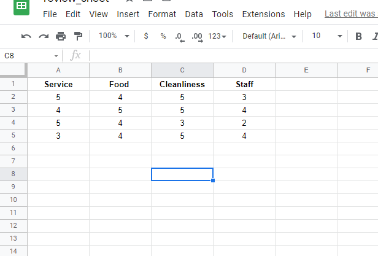

# Review Chart

[Here is the live link to my project](https://review-projectaw.herokuapp.com/)

[Git Hub Repo](https://github.com/alanwhelan1978/ReviewProject)

This project is designed for the user / customer to be able to add all review data to a google work sheet and see at a glance where their service level works and where their service levels are letting them down. 

## How to use:

The user simply has to enter the 4 review scores into the terminal and seperate the numbers by a comma. Once this is done the data is then passed to a google sheet where this data can then be analysed.The data is input by the user and it is validated and then sent to the work sheet

## Features

The terminal gives the user clear and concise instructions on what is required of them.

## Input validation and error checking

If you try to put numbers in outside the range of 1 to 5 you will recieve an error message.

If you try to put letters in you will recieve an error message.

## Data Model

The data model I used was Googlesheets where all the data entered by the user is stored and can be accessed for study at a later date.

## Testing

Passed the code through PEP8 linter and confirmed there are no problems. 

[PEP8](readmefiles/testing-1.png)

Check my input validation examples can be seen in above images.

Had friends test the application in the local terminal.

## Bugs

I had issues with the my code checking both there was only 4 numbers inserted aswell as the numbers being between 1 and 5 this was solved by adding in the check range.

## Remaining Bugs

There are none that I am aware of.

## Validator Testing

PEP8 and no issues are being dectected see image in testing section

## Depolyment

This projected was deployed using the Code Institutes mock terminal for Heroku

### Steps for deployment.

- Clone this repository
- Create a new Heroku app
- Add Config Vars
- Set the back links to Python and NodeJS in that order
- Link the Heroku app to the repository
- Click on deploy

# Credits

- Love Sandwiches
- [PEP8](http://pep8online.com/) - Testing validity of Python.
- Code Insititute

